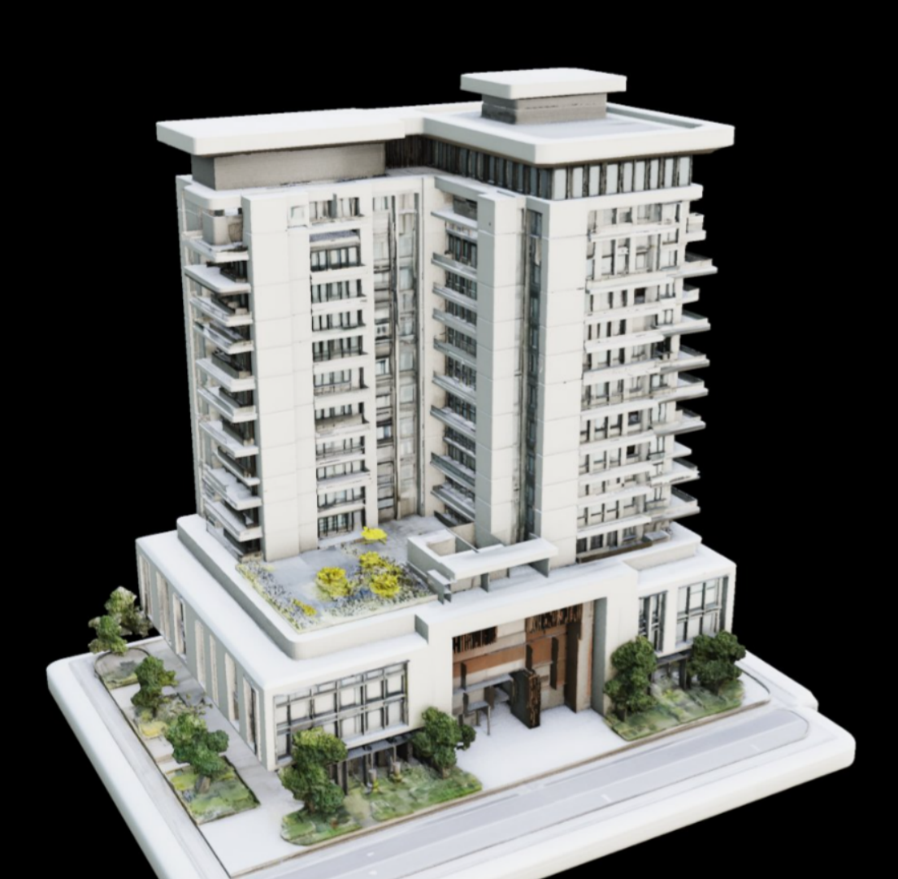
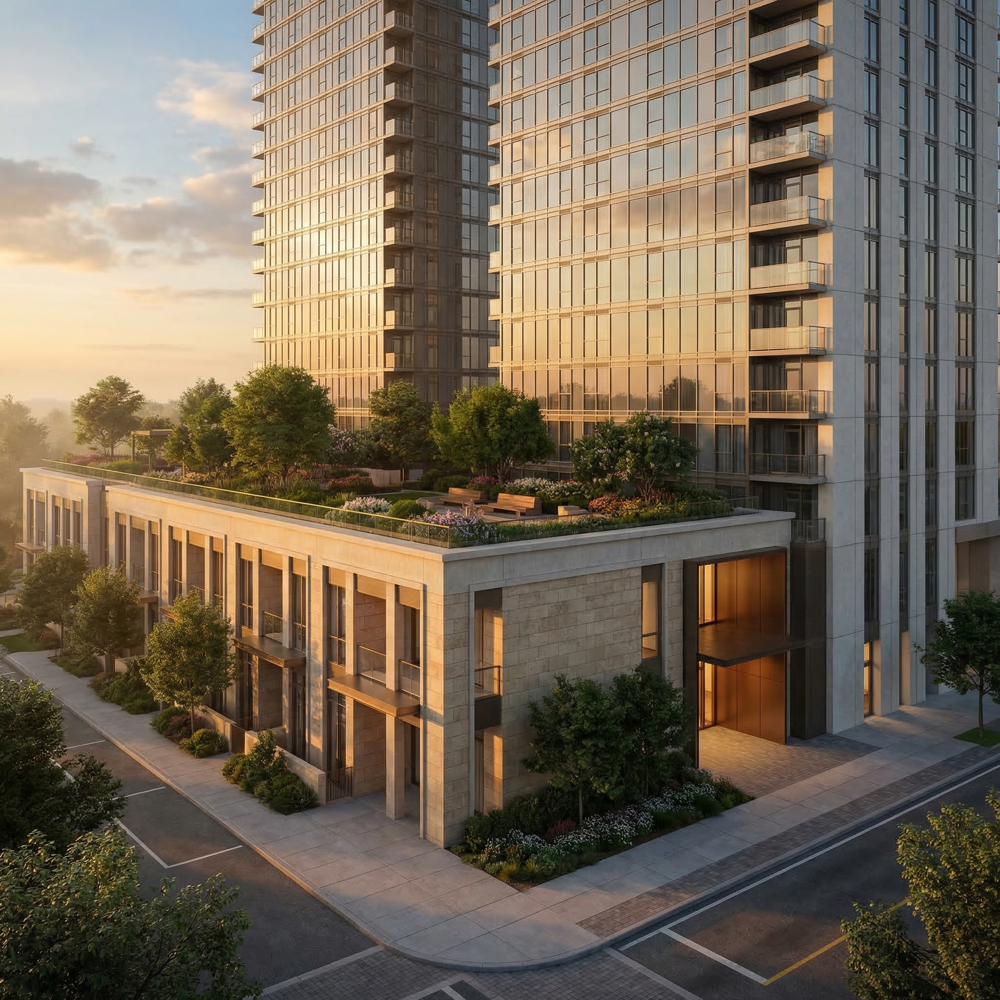
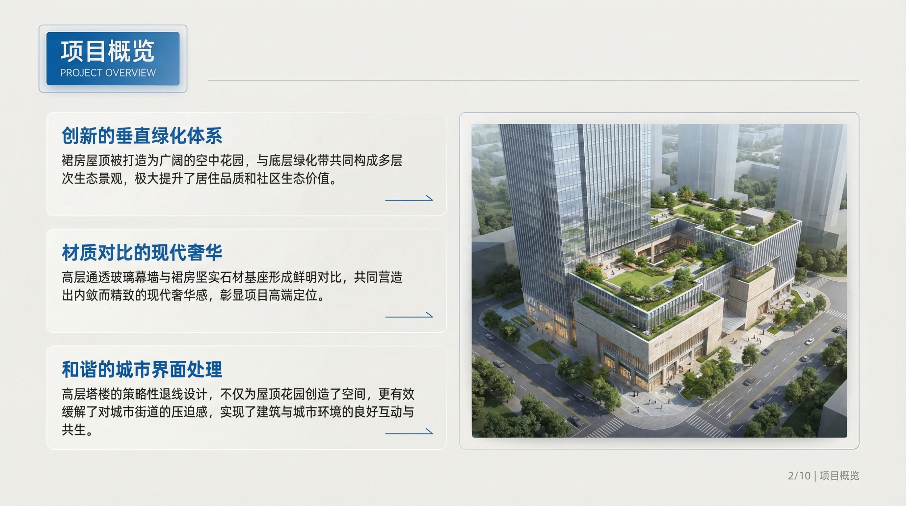

# Model2Brief 🏗️

> From rough architectural model photo to professional presentation deck — fully automated.


---

## Overview

Current AI 3D generation tools (TripoSG, Rodin, Meshy, etc.) can rapidly produce
architectural massing models, but the outputs often suffer from rough textures,
missing lighting, and insufficient detail — making them unsuitable for
professional client presentations or institutional reviews.

**Model2Brief** bridges this gap with a fully automated 3-stage AI pipeline
that takes a single photo of an architectural model and produces a complete,
presentation-ready PPT deck.

---

## Demo

| 📷 Raw Model Photo | 🎨 AI Rendered | 📊 Generated Slide |
|:---:|:---:|:---:|
|  |  |  |

---

## How It Works
```
Input Photo
    │
    ▼
┌─────────────────────────────────────────┐
│  Skill 1 · skill_render.py              │
│  Gemini Image Generation                │
│  Rough model → Photorealistic render    │
└─────────────────┬───────────────────────┘
                  │
                  ▼
┌─────────────────────────────────────────┐
│  Skill 2 · skill_report.py              │
│  Gemini Vision                          │
│  Extract architectural & urban info     │
│  Generate analysis report + charts      │
└─────────────────┬───────────────────────┘
                  │
                  ▼
┌─────────────────────────────────────────┐
│  Skill 3 · skill_ppt.py                 │
│  Gemini Image Generation                │
│  Render image + Report → PPT slides     │
└─────────────────┬───────────────────────┘
                  │
                  ▼
          outputs/{session_id}/
          ├── render_result/
          ├── report/
          └── final_output/
```

Shared context is passed between all three skills via `session.json`,
enabling each stage to build upon the previous one's output.

---

## Features

- 🎨 **Photorealistic Rendering** — Transforms rough model photos into
  professional architectural visualizations with realistic lighting,
  materials, and environment
- 🧠 **Intelligent Analysis** — Automatically identifies building type,
  facade materials, massing, landscaping, urban relationships, and
  design highlights
- 📊 **Auto-generated Charts** — Produces functional composition pie charts,
  facade material breakdowns, and greenery ratio comparisons via matplotlib
- 📐 **Architecture-first PPT Style** — Clean, professional slide design
  inspired by leading architecture firms (Zaha Hadid Architects, BIG, SANAA)
- ⚙️ **Fully Configurable** — Control slide count, style, resolution,
  lighting, and report depth via a single `config.yaml`
- 💰 **Cost-efficient** — Full 10-slide run costs approximately ¥1.6

---

## Requirements

- Python 3.8+
- Gemini API Key with Tier 1 billing enabled
  → Get one at [aistudio.google.com](https://aistudio.google.com/apikey)

---

## Installation

### 1. Clone the repository
```bash
git clone https://github.com/YOUR_USERNAME/Model2Brief.git
cd Model2Brief
```

### 2. Create and activate virtual environment
```bash
python -m venv venv

# Windows
venv\Scripts\activate

# Mac / Linux
source venv/bin/activate
```

### 3. Install dependencies
```bash
pip install -r requirements.txt
```

### 4. Configure API Key
```bash
cp .env.example .env
```
Open `.env` and fill in your Gemini API key:
```
GEMINI_API_KEY=your_api_key_here
```

---

## Usage

### Basic
```bash
# Place your image in the inputs/ folder, then run:
python agent.py --image "inputs/your_model.jpg"
```

### With options
```bash
python agent.py \
  --image "inputs/your_model.jpg" \
  --style "architecture" \
  --topic "Residential Tower — Phase 1 Review"
```

### Available arguments

| Argument | Default | Description |
|----------|---------|-------------|
| `--image` | required | Path to input image |
| `--style` | from config | PPT style: `architecture` / `gradient-glass` / `vector-illustration` |
| `--topic` | `"建筑设计分析报告"` | Report and PPT title |

> Command-line arguments take priority over `config.yaml`.

---

## Configuration

Edit `config.yaml` to set global defaults:
```yaml
# PPT Settings
ppt:
  style: "architecture"     # architecture / gradient-glass / vector-illustration
  total_slides: 10          # number of slides to generate
  resolution: "2K"          # 2K (2752x1536) or 4K (5504x3072)

# Render Settings
render:
  quality: "high"           # high / medium
  lighting: "golden_hour"   # golden_hour / daylight / dramatic

# Report Settings
report:
  language: "zh"            # zh (Chinese) / en (English)
  depth: "detailed"         # detailed / brief

# Output Settings
output:
  session_prefix: "project" # prefix for output folder names
```

---

## Output Structure

Each run generates a timestamped session folder:
```
outputs/
└── 20260309_143022/
    ├── render_result/          ← photorealistic render image
    │   └── rendered.jpg
    ├── report/                 ← architectural analysis
    │   ├── report.md
    │   └── charts/
    │       ├── functional_composition.png
    │       ├── facade_materials.png
    │       └── greenery_ratio.png
    └── final_output/           ← generated PPT slides
        ├── slide-01.png
        ├── slide-02.png
        └── ...
```

---

## PPT Styles

| Style | Best For | Preview |
|-------|----------|---------|
| `architecture` | Institutional reviews, planning reports | Clean white, planning blue |
| `gradient-glass` | Tech demos, product launches | Dark background, neon accents |
| `vector-illustration` | Education, creative proposals | Flat illustration, warm tones |

---

## Cost Reference

Based on a standard 10-slide run:

| Step | Model | Calls | Est. Cost |
|------|-------|-------|-----------|
| Vision analysis & report | gemini-2.0-flash | 5 | Free |
| Render enhancement | gemini-3-pro-image | 1 | ~¥0.15 |
| PPT slide generation | gemini-3-pro-image | 10 | ~¥1.45 |
| Chart generation | matplotlib (local) | — | Free |
| **Total** | | **16** | **~¥1.60** |

---

## Credits

PPT generation module is built upon
**[NanoBanana-PPT-Skills](https://github.com/op7418/NanoBanana-PPT-Skills)**
by [@op7418](https://github.com/op7418),
with additional architectural presentation style templates
and multi-agent workflow integration.

---

## License

MIT License — free to use, modify, and build upon.
